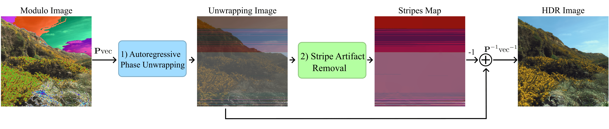

## Autoregressive High-Order Finite Difference Modulo Imaging: High-Dynamic Range for Computer Vision Applications

## Abstract
High dynamic range (HDR) imaging is vital for capturing the full range of light tones in scenes, essential for computer vision tasks such as autonomous driving. Standard commercial imaging systems face limitations in capacity for well depth, and quantization precision, hindering their HDR capabilities. Modulo imaging, based on unlimited sampling (US) theory, addresses these limitations by using a modulo analog-to-digital approach that resets signals upon saturation, enabling estimation of pixel resets through neighboring pixel intensities. Despite the effectiveness of (US) algorithms in one-dimensional signals, their optimization problem for two-dimensional signals remains unclear. This work formulates the US framework as an autoregressive $\ell_2$ phase unwrapping problem, providing computationally efficient solutions in the discrete cosine domain jointly with a stride removal algorithm also based on spatial differences. By leveraging higher-order finite differences for two-dimensional images, our approach enhances HDR image reconstruction from modulo images, demonstrating its efficacy in improving object detection in autonomous driving scenes without retraining.

### AHFD Algorithm
Proposed AHFD method for HDR image restoration from modulo measurements composed of three components: 1) Autoregressive Phase Unwrapping, 2) Stripe Artifact Removal, and 3) The operator $\textbf{P}\texttt{vec}$ to adapt AHFD for matrices. 

